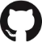

## About Me:

- 16 year old high school student in Minnesota, USA 🇺🇸
- Parents were born in Greece 🇬🇷
- Software Engineering enthusiast and always learning 🤓
- Crypto Enthusiast ₿
- Constantly working on a project or two 😉

## Socials:

    
    

## Languages and Tools:

 
 
 
 
 

## Crypto Donation Addresses:

Like what you see or found something useful? Please kindly consider donating below to support my efforts and help me continue doing what I love. Any donation amount is greatly appreciated. Thank you! 🤗

<table style="font-size: 22px; width: auto">
    <th>Coin Name</th>
    <th>Coin Acronym</th>
    <th>Donation Address</th>
    <tr>
        <td> Bitcoin</img></td>
        <td>BTC</td>
        <td>bc1qgtfxl7j4vnmftx9p9fzvwttf0lxnf0hxaqtmd6</td>
    </tr>
    <tr>
        <td> Ethereum</img></td>
        <td>ETH</td>
        <td>0xb5Ba16B8829944EB811f6156eFBa5EF015CB4d71</td>
    </tr>
    <tr>
        <td> Litecoin</img></td>
        <td>LTC</td>
        <td>ltc1qmm3mvydt6mwdzzntkhxa2dqj7ndlwcvutktzyf</td>
    </tr>
    <tr>
        <td> Monero</img></td>
        <td>XMR</td>
        <td>489rq68uT2V7RmzFJcnaAVY4zvrwpu32ngchXUWDbvsFLv8neifPRt62PiXMrTP4c5CdpRKYFS4ZDU8YKjC7R4LbADb4s9L</td>
    </tr>
    <tr>
        <td> Raptoreum</img></td>
        <td>RTM</td>
        <td>RRWtsBYMcRXMu7EzP1rDN8UajHQFew2sJ8</td>
    </tr>
    <tr>
        <td> Swap</img></td>
        <td>XWP</td>
        <td>fs3dBTNJX8XjXEH7dpzgkkZk5w5y2CnpRAF5RxBUFSszjJC7wciAhVhQAGmzPcnchjfzFA4nNWeStBHPCugwckuC13XH2362c<td>
    </tr>
        <tr>
        <td> Cosmos Hub</img></td>
        <td>ATOM</td>
        <td>cosmos1hmk6lv6s2ddhul75klwczrhke6retw6lc3qevz</td>
    </tr>
    <tr>
        <td> Osmosis</img></td>
        <td>OSMO</td>
        <td>osmo1hmk6lv6s2ddhul75klwczrhke6retw6ls2nf6s</td>
    </tr>
    <tr>
        <td> Bostrom</img></td>
        <td>BOOT</td>
        <td>bostrom1hmk6lv6s2ddhul75klwczrhke6retw6lmz52j9</td>
    </tr>
</table>

## My GitHub Stats:

<!--STARTS_HERE_QUOTE_README-->
<i>❝“Hoaxes use weaknesses in human behavior to ensure they are replicated and distributed.  In other words, hoaxes prey on the Human Operating System.”— Stewart Kirkpatrick   ❞</i>
<!--ENDS_HERE_QUOTE_README-->
